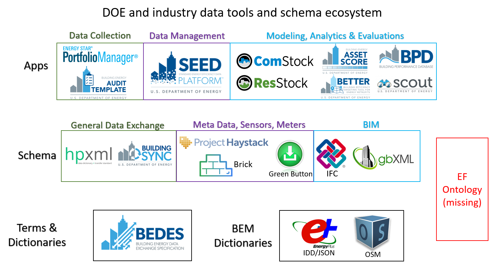

# EFOnt

## About
Energy Flexibility Ontology (EFOnt) is an open-source development effort to create a standardized schema for describing, characterizing, and quantifying building energy flexibility to support Grid-interactive Efficient Buildings. It aims to define a common vocabulary for researchers and practitioners who need to share information in the energy flexibility domain. This repository tracks the ontology development.

The ontology mainly has six components, with goals of:

* **Application Scopes** sub-domain: Specifies the scope of the problem, (e.g., system, building, or community levels)

* **Performance Goals** sub-domain: Specifies the goal that energy-flexible building operation is trying to achieve (e.g., reduce energy consumption, reduce energy cost, reduce peak demand, or reduce carbon emissions).

* **Building Services** sub-domain: Links building services to flexible operations. For example, it allows us to understand which flexible operation have what impacts on a building service (e.g., thermal conditions, air quality, etc.)

* **Flexibility Resources** sub-domain: Provides standardized definition of flexibility resources (e.g., operational - pre-cooling, infrastructure - battery) in buildings and describes the type of flexible operations they enable.

* **Flexible Load Characteristics** sub-domain: Formally characterizes flexible load profiles. For example, how does the demand change in a DR event in terms of temporal characteristics (e.g., time needed to reduce demand, duration of reduced demand) and magnitudes (e.g., maximum reduced power and rebound power)?

* **EF KPIs** sub-domain: Summarizes Key Performance Indicators (KPIs) to quantify energy flexibility. Specifies the aspects of performance they indicate, required data and formula to calculate, and stakeholders who would be interested in them.

The figure shows an overview of the ontology.

The EFOnt is developed with the [Web Ontology Language (OWL)](https://www.w3.org/TR/owl2-overview/) which is built upon the World Wide Web Consortium's (W3C) [Resource Description Framework (RDF)](https://www.w3.org/RDF/) XML standard. A common data format called [Terse RDF Triple Language (Turtle)](https://www.w3.org/TR/turtle/)) syntax is used to express data in the EFOnt.

### Motivations
The figure below shows a hierarchical ecosystem of major existing data schemas and applications led by the U.S. DOE and building industry. The bottom layer has terminologies and data dictionaries that define the most fundamental terms in the building domain. The middle layer includes data schemas and ontologies that standardize data collection, exchange, and communications. The top layer includes applications built upon the lower layer components. The motivation of the EFOnt came from the lack of standardized and common vocabulary in the energy flexibility domain. Despite a growing number of studies have focused on energy flexibility characterization and qualification, they tend to have use their own terminologies and definitions[1](https://www.sciencedirect.com/science/article/pii/S2666792421000469), which can cause redundancy and ambiguity. The EFOnt aims to provide a common vocabulary and knowledge base for building energy flexibility.  

### EFOnt vs Other Ontologies
There are already plenty of data schemas and ontologies in the market. EFOnt does not intend to reinvent the wheel and start from scratch. Luckily, the EFOnt is easily adaptive and compatible to other ontologies with the help of same underlying Semantic Web technologies. The table an comparison of a few existing ontologies and data dictionaries related to building.

| Ontology, Schema, Dictionary | Building Construction | Building Geometry | Building Topology | End-use Systems | Distributed Energy Resources | Occupant Behavior | Indoor Environment  | Sensing, IoT | Energy Management, Control | Demand Response | Energy Audit | Metrics, KPIs | Flexibility Resources, Characteristics, Quantification |
| :---: | :---: | :---: | :---: | :---: | :---: | :---: | :---: | :---: | :---: | :---: | :---: | :---: | :---: |
| IFC4 / BIM |        x | x |   |   |   |   |   |   |   |   |   |   |   |
| BES Ontology |      x | x |   |   |   |   |   |   |   |   |   |   |   |
| Brick Schema |        |   | x | x |   | x | x | x |   |   |   |   |   |
| BOT |                 |   | x |   |   |   |   |   |   |   |   |   |   |
| obXML Schema |        |   |   |   |   | x |   |   |   |   |   |   |   |
| DERs-Ontology |       |   |   |   | x |   |   |   |   |   |   |   |   |
| DogOnt |              |   |   | x |   |   | x | x | x |   |   |   |   |
| SAREF4 |              |   |   |   |   |   |   | x | x |   |   |   |   |
| DigitalBuildings |    |   |   | x |   |   |   |   |   |   |   |   |   |
| OEMA Ontologies |     |   |   | x |   | x | x |   | x | x |   |   |   |
| Project Haystack |    |   |   | x |   |   | x |   |   |   |   |   |   |
| ThinkHome |         x |   |   | x |   | x | x | x |   |   |   |   |   |
| OpenADR |             |   |   | x |   |   |   | x |   | x |   |   |   |
| EM-KPI |              |   |   | x |   | x | x |   | x |   |   | x |   |
| KPI-Onto |            |   |   | x |   |   |   |   |   |   |   | x |   |
| EnergyPlus IDD |    x | x | x |   | x | x | x | x | x |   |   |   |   |
| BuildingSync |      x |   | x |   |   | x | x | x |   |   | x |   |   |
| HPXML |             x |   | x |   | x | x | x | x |   | x |   |   |   |
| BEDES |             x |   | x |   | x | x | x | x | x | x | x | x |   |

### EFOnt Example
A few examples will be added to the examples folder in the future for demonstration purposes.

## Review & Edit
A [list](https://www.w3.org/2001/sw/wiki/Tools) of publicly available Semantic Web applications are available to work with EFOnt. We recommend the following tools depending on your need:
- For users who need a friendly user interface: [Protégé](https://protege.stanford.edu/) 
- For users who prefer programmatic views: [Owlready2](https://owlready2.readthedocs.io/en/v0.35/)

<!-- ## Contribute -->

## License
The ontology is made available by Lawrence Berkeley National Laboratory. Under ...
