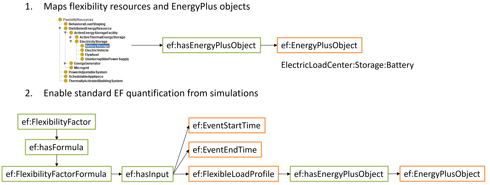
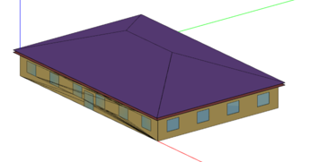
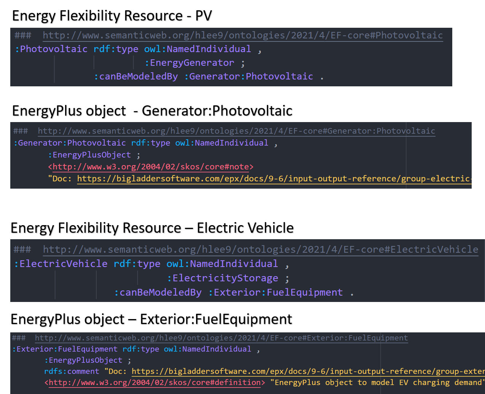
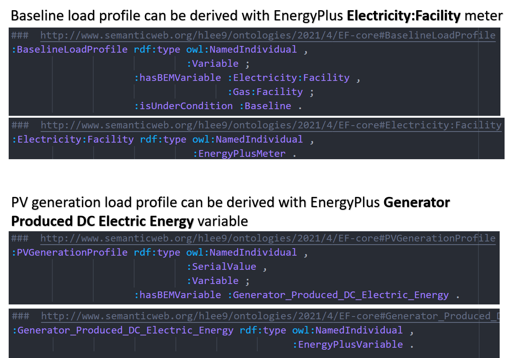
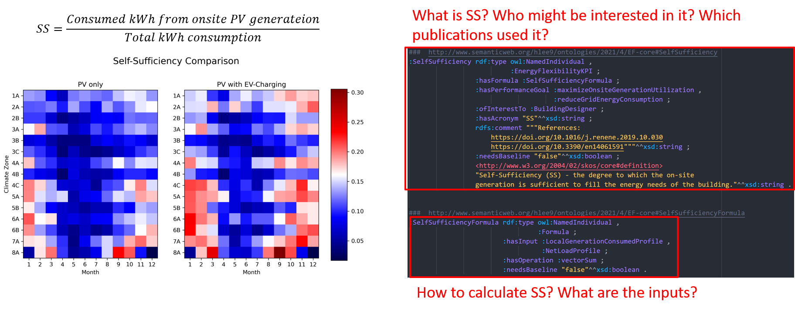
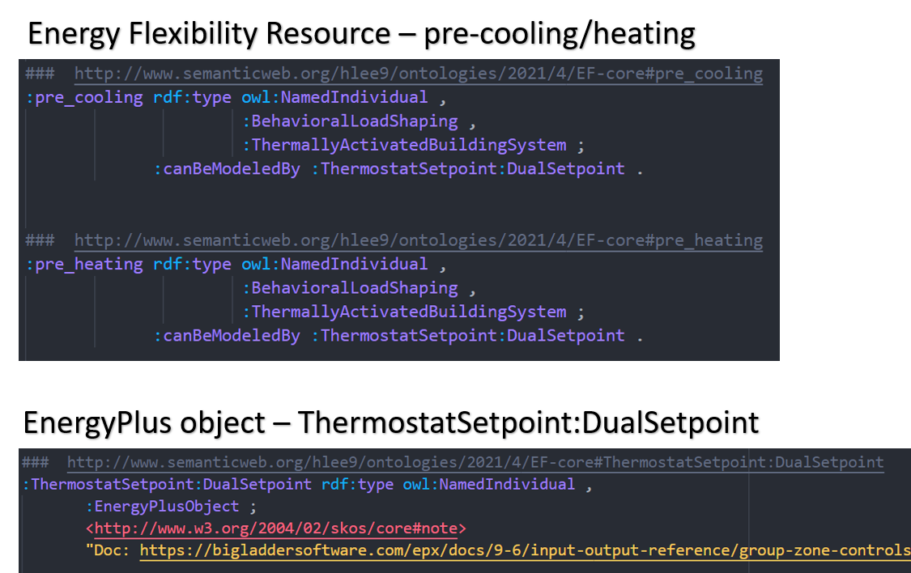
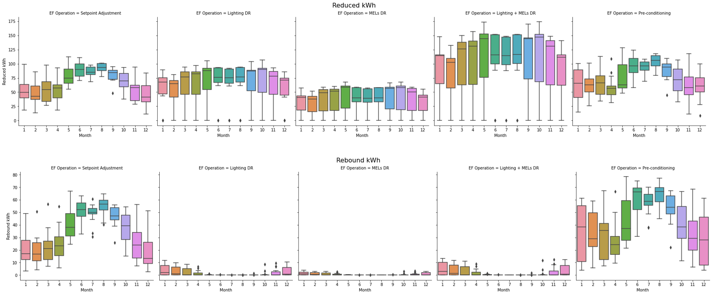

# How EFOnt can help building energy flexibility simulations

Traditionaly, BEM tools were designed to simulate building energy and thermal performance. As energy flexibility becomes an increasingly important building performance aspect, there are growing needs for simulating energy flexibility using BEM. However, the data dictionaries and input/output specifications of existing BEM tools do not have clear guidance on how to simulate energy flexibility. The barriers are mainly two-folds. Firstly, there is no description of which energy flexibility resources could be simulated using which objects in the BEM tools. Secondly, there is no description of which KPIs can be used to evaluate the energy flexibility, and which BEM sensor, meter, and variables are needed to compute the KPIs.

As a result, energy modelers who want to simulate energy flexibility need to understand which objects to modify in their models, extract the simulation results and compute the KPIs case-by-case, which can be tedious and error-prone. EFOnt can serve as an interface between energy modelers and BEM tools, which maps typical energy flexibility resources and related output variables with BEM objects. Figure 1 shows an example of such mapping. 

<figure>

<figcaption align = "center"><b>Figure 1. EFOnt for simulating Energy Flexibility with EnergyPlus objects</b></figcaption>
</figure>

# Examples

The following two examples will demonstrate how EFOnt could help simulating and quantifying building energy flexibility in more details. Both examples used DOE prototype small office building models with OpenStudio and EnergyPlus. 15 climate zones were considered to show the geographical differences. Table 1 shows the geometry and basic information of the building.

<table>
    <caption><b>Table 1. Model Description</b></caption>
    <thead>
        <tr>
            <th>Building Geometry</th>
            <th>Basic Information</th>
        </tr>
    </thead>
    <tbody>
        <tr>
            <td><figure>
                    
            </figure></td>
            <td><ul>
                <li>Building: DOE small office building</li>
                <li>Total floor area: 511.2 m²</li>
                <li>Roof area: 598.8 m²</li>
                <li>Lighting power density: 8.8 W/m²</li>
                <li>MELs power density: 6.8 W/m²</li>
                <li>Climate Zones (15): 1A, 2A, 2B, 3A, 3B, 3C, 4A, 4B, 4C, 5A, 5B, 6A, 6B, 7A, 8A</li>
            </ul></td>
        </tr>
    </tbody>
</table>

## Example 1 - EF with on-site PV generation and EV-charging
In the first example, we show how EFOnt can help quantify the on-site PV utilization performance using two EF KPIs - Self-Sufficiency and Self-Consumption. As introduced, EFOnt maps energy flexibility resources with BEM objects. 

<b>Figure 2</b> shows the flexibility resources defined in EFOnt and corresponding EnergyPlus objects to model PV generation and EV demand.

<figure>

<figcaption align = "center"><b>Figure 2. EFOnt maps energy flexibility resources with EnergyPlus objects</b></figcaption>
</figure>

<b>Figure 3</b> shows the mapping between energy EnergyPlus outputs to KPI computation inputs.

<figure>

<figcaption align = "center"><b>Figure 3. EFOnt maps energy EnergyPlus outputs to KPI computation inputs</b></figcaption>
</figure>

<b>Figure 4</b> shows (1) left: the heatmap of the monthly PV Self-Suffciency (SS) in the building at different locations with and without EV charging, and (2) right: how EFOnt can help computing the KPI. It can be seen that with EV charging could benefit the on-site generated PV utilization. 
<figure>

<figcaption align = "center"><b>Figure 4. Simulated PV Self-Sufficiency results and how EFOnt helped the calculation</b></figcaption>
</figure>

## Example 2 - EF with peak reduction operations (pre-cooling and pre-heating, lighting and MELs reduction)

In the second example, we show how EFOnt can help simulating the peak power reduction potential of several measures shown in Table 2.

<table>
    <caption><b>Table 2. Peak Power Reduction Measures</b></caption>
    <thead>
        <tr>
            <th>Measure Name</th>
            <th>Description</th>
        </tr>
    </thead>
    <tbody>
        <tr>
            <td>
                Temperature setpoint adjustment
            </td>
            <td><ul>
                <li>Increase cooling setpoint by 2 degF between 13 ~ 16pm</li>
                <li>Decrease heating setpoint by 2 degF between 13 ~ 16pm</li>
            </ul></td>
        </tr>
        <tr>
            <td>
                Pre-heating and Pre-cooling
            </td>
            <td><ul>
                <li>Pre-heating increase the cooling setpoint by 2 degF between 7am and 11am</li>
                <li>Pre-cooling lower the cooling setpoint by 2 degF between 7am and 11am</li>
            </ul></td>
        </tr>
        <tr>
            <td>
                Lighting power adjustment
            </td>
            <td><ul>
                <li>Reduce lighting power by 60% for unoccupied and 30% for occupied zones</li>
            </ul></td>
        </tr>
        <tr>
            <td>
                MELs power adjustment
            </td>
            <td><ul>
                <li>Reduce lighting power by 80% for unoccupied and 20% for occupied zones</li>
            </ul></td>
        </tr>
    </tbody>
</table>

<b>Figure 5</b> shows how pre-cooling and pre-heating could be simulated with EnergyPlus. Other measures have similar logic, but are not shown for simplicity.  
<figure>

<figcaption align = "center"><b>Figure 5. Simulated PV Self-Sufficiency results and how EFOnt helped the calculation</b></figcaption>
</figure>

<b>Figure 6</b> shows the simulated measures' influences on the monthly peak energy reduction and the rebound energy. Each box plot shows the range the reduced energy and rebound energy across 15 climate zones. Note that the temperature adjustment measures can reduce the peak demand but also come with rebound effects, while lighting and MELs power reduction measures have almost no rebound effect.

<figure>

<figcaption align = "center"><b>Figure 5. Simulated PV Self-Sufficiency results and how EFOnt helped the calculation</b></figcaption>
</figure>

# Notes

The two examples demonstrate how EFOnt can help simulating building energy flexibility by (1) mapping the flexibility resources with BEM objects, (2) mapping the BEM outputs with EF KPIs, and (3) providing a reference of calculating the EF KPIs. Althogh the case studies were done manually, there are potentials to automate this process by integrating the semantic ontology with BEM tools. An option is to develop intermediate software tools (e.g., OpenStudio measures) that could read BEM models and EFOnt, and prepare the whole simulation workflow.

