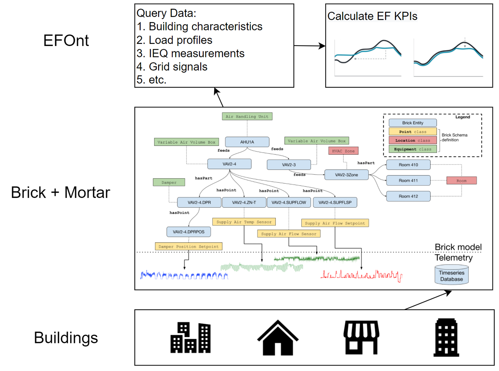

# How EFOnt can help building energy flexibility analytics using measured data.

As sensing and metering technologies become widely available, more and more building operational data are collected from building automation systems (BAS) and smart thermostats at scale. In general, those data provides opportunity to unlock building energy flexibility from two perspectives:
1. Analyzing energy flexibility of past operation strategies using historical measurements (post hoc).
2. Developing data-driven models which could then be used to predict energy flexibility in the future (ex ante).

Either approach needs to clearly define, characterize, and quantify energy flexibility. The lack of commonly agreed energy flexibility terminologies, data requirements, and quantification methods lead to confusion and redundancy. EFOnt aims to serve as common ground of energy flexibility, where researchers and practitioners can co-develop standardized terminologies and KPIs.

# Example

In the following example, we show how EFOnt can help quantify energy flexibility using the EcoBee smart thermostat data. The thermostat data include timeseries of indoor air temperature, cooling and heating setpoint temperature, supply fan runtime, cooling and heating system runtime. It also recorded special events such as demand response (DR), during which the thermostat can adjust the temperature setpoint to reduce power demand. A KPI called Flexibility Factor (FF) shown in the below equation is used to quantify daily energy flexibility during a demand response event.

<table align="center" border=0>
  <tr>
    <td align="center"></td>
    <td><figcaption><b>Equation 1. Flexibility Factor</b></figcaption></td>
  </tr>
</table>

FF needs the system runtime profile and DR event start and end timestamps. Figure 1 shows how EFOnt defines the KPI and acronym, specifies the required data, performance goals, and stakeholders who might be interested  (left). It also shows how the specified inputs are used in the calculation (right). On this particular day, the purple dash line indicates the cooling system (compressor) runtime, the black dash line shows the cooling setpoint temperature, the green line shows the room air temperature, and the pink shaded area indicates the DR event. It can be seen that the cooling setpoint temperature was raised from around 74.2 °F to 78 °F as the DR event started, the system paused running, and the room air temperature gradually increased. Since most the cooling system almost didn't operate during the DR event, its FF was 0.983.

<table align="center" border=0>
  <tr>
    <td align="center"></td>
  </tr>
  <tr>
    <td align="center"><figcaption><b>Figure 1. Flexibility Factor example</b></figcaption></td>
  </tr>
</table>

# Other Potential Use Cases

EFOnt is based on semantic web framework, which means it is compatible with many other existing ontologies in the broad building, energy, and IoT fields. For example, Brick schema provides standardized semantic description of physical, logical and virtual assets in buildings [2], and can be seamlessly integrated with other tools and databases for data query and analytics [3]. For energy flexibility analytics, EFOnt can provide instructions on which sensors and meters to query, and how to calculate quantify energy flexibility with the queried data. Figure 2 shows conceptually how EFOnt can be supplementary to Brick for energy flexibility analytics using measurements.

<table align="center" border=0>
  <tr>
    <td align="center"></td>
  </tr>
  <tr>
    <td align="center"><figcaption><b>Figure 2. Schematics of how EFOnt + Brick for energy flexibility analytics</b></figcaption></td>
  </tr>
</table>

## References
[1] 2022. EcoBee Donate Your Data Program. Available at: <https://www.ecobee.com/donate-your-data/> [Accessed 26 April 2022].

[2] Balaji, B., Bhattacharya, A., Fierro, G., Gao, J., Gluck, J., Hong, D., ... & Whitehouse, K. (2016, November). [Brick: Towards a unified metadata schema for buildings](https://dl.acm.org/doi/abs/10.1145/2993422.2993577). In Proceedings of the 3rd ACM International Conference on Systems for Energy-Efficient Built Environments (pp. 41-50).

[3] Fierro, G., Pritoni, M., AbdelBaky, M., Lengyel, D., Leyden, J., Prakash, A., ... & Culler, D. E. (2019). [Mortar: an open testbed for portable building analytics](https://dl.acm.org/doi/abs/10.1145/3366375). ACM Transactions on Sensor Networks (TOSN), 16(1), 1-31.
