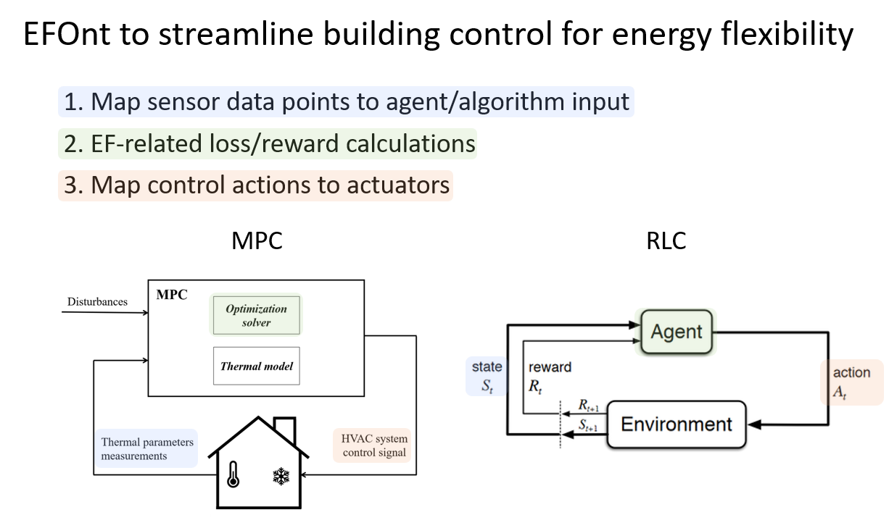

# How EFOnt can streamline building controls for energy flexibility.

EFOnt can be used to configure building controllers with Model Predictive Control (MPC) and Reinforcement Learning Control (RLC) for energy flexibility from three perspectives shown in Figure 1.  

<table align="center" border=0>
  <tr>
    <td align="center"></td>
  </tr>
  <tr>
    <td align="center"><figcaption><b>Figure 1. Configuring building controls with EFOnt</b></figcaption></td>
  </tr>
</table>

More concrete case studies will be added in the future.